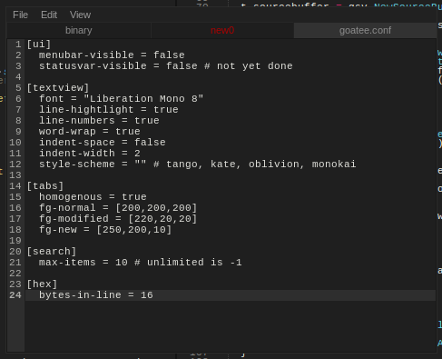
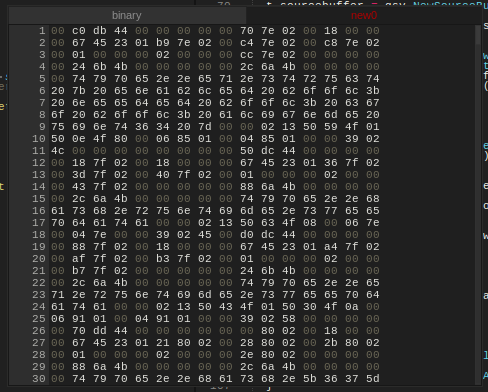

# GOATee - simple gtk2 text editor written on Go

# Configure

`goatee.conf` is example of config file, text editor tries to get it by `XDG_CONFIG_PATH/goatee/` or from working directory.

# Features

 * multiple homogeneous(*full width*) Tabs
 * auto detect charset and binary files
 * smart detect language(syntax) for text files
 * hex editor for binary files with search and replacet

# Screenshots

**text file:**

**binary file with hidden menu:**

# Requirements
 
 * gtk2
 * gtksourceview2

# Knownbugs
 * for hex view regexp replace not work
 * for hex view search with regexp, some expressions not correct, because search is performed for a hex string not for a byte array